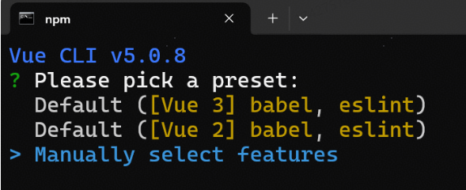
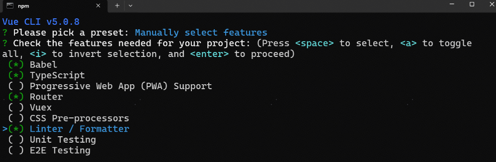
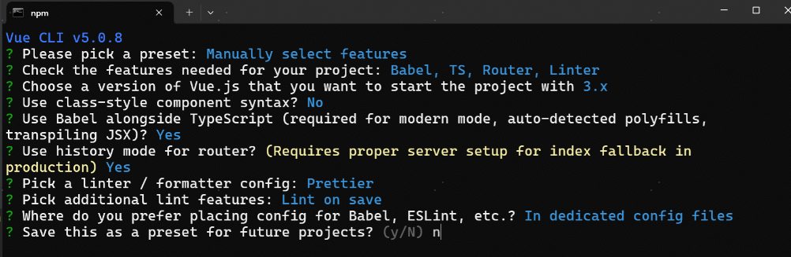

# vue-demo

## Project setup
```
npm install
```

### Compiles and hot-reloads for development
```
npm run serve
```

### Compiles and minifies for production
```
npm run build
```

### Lints and fixes files
```
npm run lint
```

### Customize configuration
See [Configuration Reference](https://cli.vuejs.org/config/).

# 项目构建

## 初始化
```

npm -V

npm install -g @vue/cli

vue -V

vue create vue-demo
```






## 前端工程化配置

.eslintrc.js
tsconfig.json

## 引入组件库

```
npm install --save-dev @arco-design/web-vue
```

配置main.js文件

## 配置通用布局和路由

BasicLayout.vue
routes.ts
index.ts


## 引入请求工具库

```
npm install axios
```

## 引入 Pinia

```
npm install pinia
```

配置main.js文件
import { createPinia } from 'pinia'
const pinia = createPinia()
app.use(pinia)

## 全局权限管理

access 目录


## 通用组件 - Markdown 编辑器组件

```
npm i @bytemd/vue-next
npm i @bytemd/plugin-highlight @bytemd/plugin-gfm
```

## 通用组件 - 图片上传


# 项目结构

- src
  - layouts 布局
  - router 路由
  - components 组件
  - views 界面
  - App.vue 界面入口
  - access 权限
  - store 状态
  - api 接口
  - request.ts 请求配置
  - main.ts 配置
- openapi.config.ts 接口配置
- package.json 类似pom，写启动脚本


